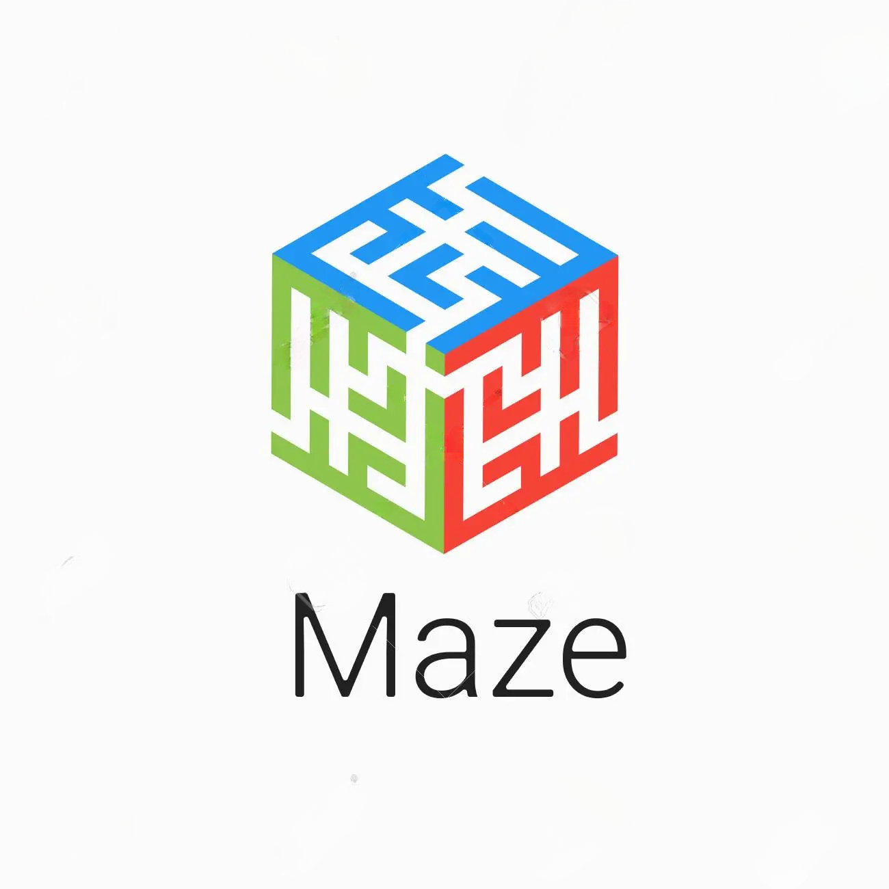

<h1>MAZE GAME🐍</h1>

  Hola! 👨‍💻. Somos estudiantes del curso de Programación III de UTEC.  
  Hemos aplicado conocimientos aprendidos durante el curso de Programación para desarrollar el juego Maze en C++.
  

  
Tabla de contenidos:

  <ol>
    <li><a href="#acerca-del-proyecto">
      Acerca del proyecto
      <ul>
        <li><a href="#descripción">Descripción</a></li>
        <li><a href="#características">Características</a></li>
        <li><a href="#tecnologías">Tecnologías</a></li>
        <li><a href="#temas-de-interés">Temas de interés</a></li>
        <li><a href="#algoritmos-y-contenedores-utilizados">Algoritmos y contenedores utilizados</a></li>
      </ul>
    </a></li>
    <li><a href="#instalación">
      Instalación
      <ul>
        <li><a href="#requisitos">Requisitos</a></li>
        <li><a href="#pasos-de-instalación">Pasos de instalación</a></li>
      </ul>
    </a></li>
    <li><a href="#instrucciones-de-uso">
      Instrucciones de uso
    </a></li>
    <li><a href="#licencia">
      Licencia
    </a></li>
    <li><a href="#diagramas">
      Diagramas
      <ul>
        <li><a href="#matriz-del-tablero">Matriz del Tablero</a></li>
      </ul>
    </a></li>
    <li><a href="#link-del-video">
      Link del video
    </a></li>
    <li><a href="#autores">
      Autores
    </a></li>
    <li><a href="#referencias-y-links">
      Referencias y links
    </a></li>
  </ol>

---

## Acerca del proyecto

### Descripción

### Características

#### Características Principales

#### Caracteristicas Adicionales

### Tecnologías

- Lenguaje de programación C++17 o posterior
- Librería raylib 
- Raylib-cpp (header only, fork)

### Algoritmos y contenedores utilizados

#### DFG (Depth First Search)
Este algoritmo emplea en su implementación el concepto de stack. Lo que hace es recorrer en su totalidad una estructura. 
Cada vez que se encuentra con dos o más caminos posibles, este recorrerá cada uno lo más profundamente posible, a la 
vez que almacena los nodos recorridos en un stack. Si alcanza un camino sin salida antes que el objetivo, este retrocede a 
la bifurcación anterior y repite el proceso. Este algoritmo, aunque puede cumplir con el objetivo, no es eficiente en lo 
absoluto, considerando que existen alternativas más eficientes.

- BFG (Breadth First Search)

#### GBFS (Greedy Best First Search)
Este es un algoritmo de búsqueda heurística, es decir, necesita información adicional específica relacionada con el 
problema a resolver. En el caso de un laberinto, lo que requiere es el número de casillas de distancia a la que se 
encuentra cada casilla del objetivo. Lo que el algoritmo GBFS busca es reducir este número conforme se mueve de casilla 
en casilla. Si alcanza un punto sin salida, retrocede de nuevo al último cruce. A pesar de siempre buscar la casilla 
más cercana al objetivo, no puede garantizar que el camino elegido será el más eficiente. 

- A*
- Kruskal
- Wilsons (chosen one)

## Instalación

### Requisitos

### Pasos de instalación

## Instrucciones de uso

### Instrucciones

### Reglas de juego

## Licencia

Distribuido bajo la licencia MIT. Ver [`LICENSE`](LICENSE) para más información.

## Diagramas

### Matriz del Tablero

## Link del video

## Autores

- Camila Villasana Boggiano
- Diana Carolina Ñañez Andres
- Jaime Alfonso Ramos Talla
- Kevin Jonás Zevallos López
- Enrique Francisco Flores Teniente
- Luis Enrique Cortijo

## Bibliografía
- CS50 (2020). Search - Lecture 0 - CS50's Introduction to Artificial Intelligence with Python 2020 [Video]. Edx. https://youtu.be/WbzNRTTrX0g 

---

[Back To The Top](#readme-top)

# TODO

### media:

#### square types
- ~~WALL~~
- ~~EMPTY~~
- ~~START~~
- ~~GOAL~~

#### Sprites
- ~~button background~~
- game background
- Different end screens
- ~~Bot image~~

